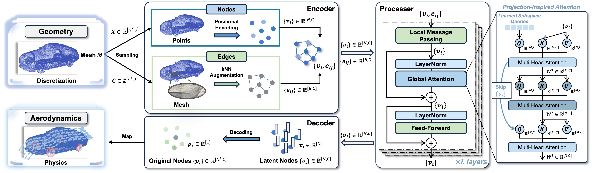

# AeroGTO
**AeroGTO: An Efficient Graph-Transformer Operator for Learning Large-Scale Aerodynamics of 3D Vehicle Geometries**

Obtaining high-precision aerodynamics in the automotive industry relies on large-scale simulations with computational fluid dynamics, which are generally time-consuming and computationally expensive. Recent advances in operator learning for partial differential equations offer promising improvements in terms of efficiency. However, capturing intricate physical correlations from extensive and varying geometries while balancing large-scale discretization and computational costs remains a significant challenge. To address these issues, we propose **AeroGTO**, an efficient graph-transformer operator designed specifically for learning large-scale aerodynamics in engineering applications. AeroGTO combines local feature extraction through message passing and global correlation capturing via projection-inspired attention, employing a frequency-enhanced graph neural network augmented with k-nearest neighbors to handle three-dimensional (3D) irregular geometries. Moreover, the transformer architecture adeptly manages multi-level dependencies with only linear complexity concerning the number of mesh points, enabling fast inference of the model. Given a car's 3D mesh, AeroGTO accurately predicts surface pressure and estimates drag. In comparisons with five advanced models, AeroGTO is extensively tested on two industry-standard benchmarks, Ahmed-Body and DrivAerNet, achieving a 7.36\% improvement in surface pressure prediction and a 10.71\% boost in drag coefficient estimation, with fewer FLOPs and only 1\% of the parameters used by the prior leading method.

**The core contributions of this work are:**
- To tackle the challenges of representing complex physical correlations in large-scale aerodynamics, we present a frequency-enhanced GNN augmented with kNN specifically designed for precise local feature extraction. This method effectively isolates and captures physical information of points and edges and projects this spatial data into a topologically structured hidden space, thereby enhancing interpretability.
- We depart from the standard Transformer architecture by introducing a global Transformer with linear projection-inspired attention. This innovation captures long-range dependencies between mesh points and enables multi-level interactions between intricate local and global physical correlations.
- We conduct numerical experiments on two industry-standard benchmarks, Ahmed-Body and DrivAerNet, showcasing that AeroGTO reduces error by 7.36\% on average while requiring fewer FLOPs and using only 1\% of the parameters compared to the leading method. Additionally, AeroGTO improves the prediction accuracy of the pressure drag coefficient on the unseen Ahmed-Body test set, with a 10.71\% performance boost and an overall $R^2$ of 0.9250.

## Data
We briefly introduce the datasets used in the experiments.
- **Ahmed-Body** dataset [1] is an industry-standard simulation of vehicle aerodynamics based on Ahmed-body shapes [2], containing 0.12 million surface mesh faces. It consists of 551 shapes, with 500 allocated for training and 51 for testing.
- **DrivAerNet** dataset [2] is a large-scale, high-fidelity CFD dataset with thousands of 3D car meshes, featuring 0.5 million surface mesh faces—60\% larger than the previously available largest public car dataset. Due to the computational cost, we randomly selected 550 cars, using 500 for training and 50 for testing.

**Dataset Link**:
- Ahmed-Body (from GINO's experiments): [Ahmed-Body](https://openreview.net/forum?id=86dXbqT5Ua)
- DrivAerNet (from DrivAerNet's experiments): [DrivAerNet](https://github.com/Mohamedelrefaie/DrivAerNet/)

## Training

### Code Structure

### How to use

## Inference

## References
- [1] Li Z, Kovachki N, Choy C, et al. Geometry-informed neural operator for large-scale 3d pdes[J]. Advances in Neural Information Processing Systems, 2024, 36.
- [2] Ahmed S R, Ramm G, Faltin G. Some salient features of the time-averaged ground vehicle wake[J]. SAE transactions, 1984: 473-503.
- [3] Elrefaie M, Dai A, Ahmed F. Drivaernet: A parametric car dataset for data-driven aerodynamic design and graph-based drag prediction[J]. arXiv preprint arXiv:2403.08055, 2024.

