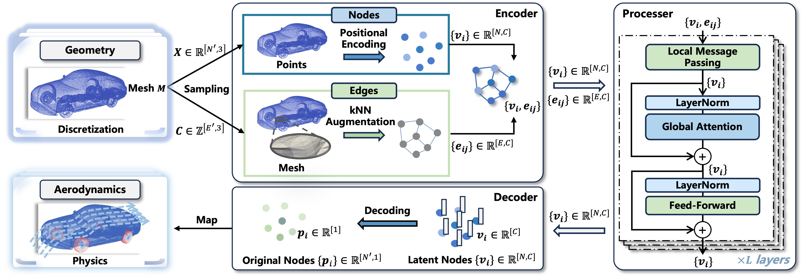
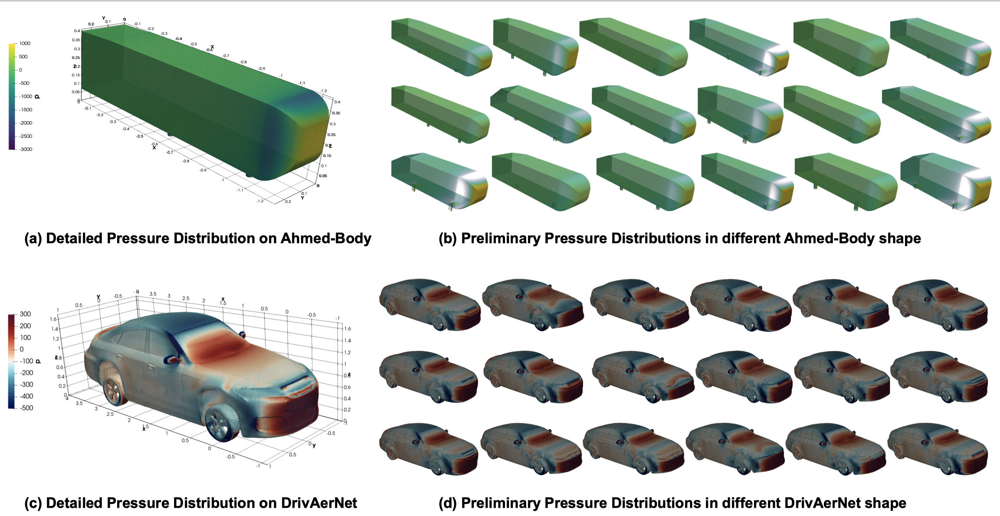

# AeroGTO (AAAI 2025)
**AeroGTO: An Efficient Graph-Transformer Operator for Learning Large-Scale Aerodynamics of 3D Vehicle Geometries**



## Data
We briefly introduce the datasets used in the experiments.
- **Ahmed-Body** dataset [1] is an industry-standard simulation of vehicle aerodynamics based on Ahmed-body shapes [2], containing 0.12 million surface mesh faces. It consists of 551 shapes, with 500 allocated for training and 51 for testing.
- **DrivAerNet** dataset [3] is a large-scale, high-fidelity CFD dataset with thousands of 3D car meshes, featuring 0.5 million surface mesh faces—60\% larger than the previously available largest public car dataset. Due to the computational cost, we randomly selected 550 cars, using 500 for training and 50 for testing.

**Dataset Link**:
- Ahmed-Body (from GINO's experiments): [Ahmed-Body](https://openreview.net/forum?id=86dXbqT5Ua)
- DrivAerNet (from DrivAerNet's experiments): [DrivAerNet](https://github.com/Mohamedelrefaie/DrivAerNet/)



## Baselines
We compare AeroGTO with five competitive baselines in these two car datasets. 
- **MeshGraphNet (MGN)** [4] is a classical GNN-based model that relies on multiple chained message-passing layers. 
- **GNOT** [5] is a scalable transformer framework with linear attention and mixture-of-expert, exemplifying the strengths of the linear-attention class. 
- Both **Transolver** [6] and **IPOT** [7] are transformer variants for geometric learning operators with low computational complexity. 
- **GINO** [1] is a novel neural operator for large-scale complex simulation benchmarks with FNO [8] blocks.

## Code 

**Due to the ongoing review process, we are providing only a portion of the source code containing the complete GINO code.
We will release the complete code once the review is concluded. We appreciate your understanding. Ensuring the reproducibility of our results is a priority for us, and we are committed to making all necessary materials available to support this.**

### Structure

Please maintain the file structure shown below to run the script by default. The dataset folder for the baseline GINO should be located within the GINO directory.

```sh
this project
│   ...    
│
└───dataset
│   └───train
│       │   info_*.pt
│       │   press_*.pt
│   └───test
|       |   └───...
│   └───data
|       |   └───train
|       |       |   centroids_*.npy
|       |       |   areas_*.npy
|       |   └───test
|       |       └───...
│   └───edges
|       |   └───train
|       |       |   cell_edges_*.npy
|       |   └───test
|       |       └───...
│   └───dragWeight_test
|        |    dragWeight_*.npy
└───gino
│   └───...
└───model
│   └───...
```

### Requirements

You can install the required dependencies using the following command:

```
pip install -r ./requirements.txt
```

### How to use

Use the following command to train the model:

```sh
export OMP_NUM_THREADS=32
export NCCL_P2P_DISABLE=1 
export TORCH_DISTRIBUTED_DEBUG=INFO
export TORCH_DISTRIBUTED_DEBUG=DETAIL
export CUDA_LAUNCH_BLOCKING=1

export CUDA_VISIBLE_DEVICES=0,1,2
# ./configs/$case_name: stores the corresponding config files of a case

# 1. AeroGTO
python main.py --config ./configs/AeroGTO.json

# 2. GNOT
python main.py --config ./configs/GNOT.json

# 3. IPOT
python main.py --config ./configs/IPOT.json

# 4. MGN
python main.py --config ./configs/MGN.json

# 5. Transolver
python main.py --config ./configs/Transolver.json

# 6. GINO
# see ./gino/
```

or simply run:
```sh
run_all.sh
```

## References
- [1] Li Z, Kovachki N, Choy C, et al. Geometry-informed neural operator for large-scale 3d pdes[J]. Advances in Neural Information Processing Systems, 2024, 36.
- [2] Ahmed S R, Ramm G, Faltin G. Some salient features of the time-averaged ground vehicle wake[J]. SAE transactions, 1984: 473-503.
- [3] Elrefaie M, Dai A, Ahmed F. Drivaernet: A parametric car dataset for data-driven aerodynamic design and graph-based drag prediction[J]. arXiv preprint arXiv:2403.08055, 2024.
- [4] Pfaff T, Fortunato M, Sanchez-Gonzalez A, et al. Learning mesh-based simulation with graph networks[J]. arXiv preprint arXiv:2010.03409, 2020.
- [5] Hao Z, Wang Z, Su H, et al. Gnot: A general neural operator transformer for operator learning[C]//International Conference on Machine Learning. PMLR, 2023: 12556-12569.
- [6] Wu H, Luo H, Wang H, et al. Transolver: A fast transformer solver for pdes on general geometries[J]. arXiv preprint arXiv:2402.02366, 2024.
- [7] Lee S, Oh T. Inducing Point Operator Transformer: A Flexible and Scalable Architecture for Solving PDEs[C]//Proceedings of the AAAI Conference on Artificial Intelligence. 2024, 38(1): 153-161.
- [8] Li Z, Kovachki N, Azizzadenesheli K, et al. Fourier neural operator for parametric partial differential equations[J]. arXiv preprint arXiv:2010.08895, 2020.
